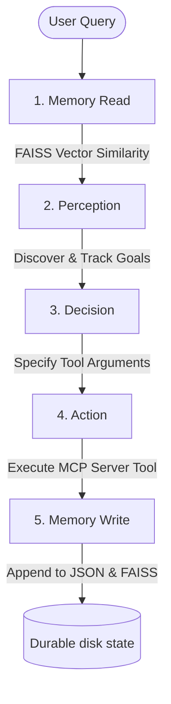

# Agent7-RAG: Production-Quality RAG Agent with Persistent Vector Memory

A production-grade, persistent Retrieval-Augmented Generation (RAG) system built on the **Memory → Perception → Decision → Action** (MCP) agent architecture. This repository implements durable semantic vector recall, recursion-driven directory ingestion, and absolute separation of concerns.

---

## 1. Agent Architecture & Flow

The system strictly enforces the boundaries between agent layers, ensuring that intent discovery, goal tracking, and tool execution are completely decoupled.



### Decoupled Agent Layers
1.  **Memory Read:** Queries the local FAISS index via cosine similarity. If the vector index is empty, it falls back to token-overlapping keyword search.
2.  **Perception:** Directs goal-tracking. Evaluates historical events and memory hits to determine pending, completed, or newly discovered goals. To maintain absolute isolation, **zero MCP tool names are present in the Perception system prompt** (verified via static grep testing).
3.  **Decision:** Evaluates current goals, history, and raw bytes of attached artifacts, selecting either a plain text answer or an MCP tool call with exact arguments.
4.  **Action:** Executes tools using the standard MCP protocol `ClientSession` and registers outcomes.
5.  **Memory Write:** Deterministically records tool outcomes and embeds new fact descriptors at insertion time, updating both the persistent JSON store and the FAISS index.

---

## 2. Workspace Directory Structure

*   `queries.docx`: The Microsoft Word document containing the 8 standard base evaluation queries.
*   `queries.txt`: Plaintext extraction of `queries.docx` for programmatic reference.
*   `S7code/`: Core implementation containing:
    *   `agent7.py`: The agent orchestrator and loop execution engine.
    *   `mcp_server.py`: Model Context Protocol (MCP) server providing advanced RAG tools.
    *   `perception.py`, `decision.py`, `action.py`, `memory.py`: Modules implementing the decoupled agent layers.
    *   `eval_rag.py`: The automated evaluation harness that runs static prompt audits, indexes the sandbox corpus, and runs all 13 queries.
    *   `sandbox/corpus/`: Ingested corpus of **52 high-quality markdown documents** covering machine learning, deep learning, optimization, evaluation, and alignment.
    *   `sandbox/papers/`: Reference papers (Attention, Chain-of-Thought, DPO, LoRA, ReAct) used for base RAG queries.
    *   `traces/`: Execution logs and response markdown traces for every query run.
    *   `state/`: Durable index files (`memory.json`, `index.faiss`, `index_ids.json`) crossing the process boundary.
*   `llm_gatewayV7/`: The local API gateway serving LLM models, routing requests, and providing vector embeddings via `/v1/embed`.

---

## 3. Persistent Vector Memory Design

Vector embeddings are computed using the gateway's `/v1/embed` endpoint. The vector pipeline is completely self-contained and persists across process boundaries through three synchronized files under `S7code/state/`:

*   `S7code/state/memory.json`: Structured storage carrying all model metadata, keywords, raw content, and embedding vectors.
*   `S7code/state/index.faiss`: Binary FAISS vector index storing L2-normalized 384-dimensional or 1536-dimensional embeddings.
*   `S7code/state/index_ids.json`: Mapping index linking FAISS vector coordinates back to memory item IDs.

When a fresh agent process is launched, the agent instantly loads the FAISS index from disk. Semantic similarity searches are resolved locally in microseconds without requiring document re-ingestion.

---

## 4. Model Context Protocol (MCP) RAG Tools

Four specialized RAG tools are implemented inside `mcp_server.py`:

*   `index_document`: Chunks sandbox files (Markdown, Plain Text, or PDFs) using a sliding window (400-word chunks, 80-word overlap) with exact character offsets.
*   `index_directory`: Recursively traverses directories. It maintains an idempotent state database (`state/indexed_files.json`) of SHA-256 content hashes to skip duplicate processing and accelerate ingestion.
*   `semantic_search`: Performs vector similarity queries against the FAISS index, returning high-precision matched chunks, offsets, and source files.
*   `corpus_stats`: Generates complete analytical reports over the corpus (file count, chunk distributions, file type ratios).

---

## 5. Ingested AI/ML Corpus

Under `sandbox/corpus/`, the system maintains a diverse corpus of **52 high-quality markdown documents** covering essential machine learning, transformer, and agentic design concepts:

*   **Transformers & Attention:** `attention_mechanism.md` (Transformer architecture), `self_attention.md`, `bert.md`, `t5.md`.
*   **Alignment & Tuning:** `dpo.md` (Direct Preference Optimization), `rlhf.md` (RLHF), `ppo.md` (PPO), `lora.md` (LoRA).
*   **Reasoning & Frameworks:** `chain_of_thought.md` (Chain-of-Thought), `react.md` (ReAct), `few_shot_learning.md`, `zero_shot_learning.md`.
*   **Evaluation & Optimization:** `precision_and_recall.md` (evaluation metrics), `rouge.md`, `gradient_descent.md`, `support_vector_machines.md`, `random_forest.md`.

---

## 6. Evaluation Queries

### Standard Queries (A to H)
These 8 base queries are verbatim from `queries.docx` and evaluate architectural capabilities:
*   **Query A (Claude Shannon Wikipedia):** Verifies tool usage, artifact creation, and multi-goal memory carryover.
*   **Query B (Tokyo activities and weather):** Tests multi-goal decomposing, weather tool calls, and logical synthesis.
*   **Query C (Mom's birthday - Runs 1 & 2):** Assesses durable memory and creation of reminders in the sandbox across separate runs.
*   **Query D (Asyncio research):** Tests multi-source synthesis, web search, page fetching, and artifact compilation.
*   **Query E (Single-document index/extract):** Indexes `papers/attention.md` and extracts the 3 key contributions of Transformers.
*   **Query F (Cross-run document recall - Runs 1 & 2):** Ingests all `.md` files under `papers/` in Run 1 and verifies persisted cross-run FAISS retrieval in a fresh process in Run 2.
*   **Query G (Synonym recall):** Validates that vector similarity succeeds in retrieving concepts (e.g. credit assignment) where exact keyword overlap yields zero hits.
*   **Query H (Cross-document synthesis):** Compares how the ReAct and Chain-of-Thought papers differ in their treatment of intermediate reasoning.

### Custom RAG Queries (I to M)
These 5 custom queries specifically evaluate semantic retrieval and synthesis performance over the 52-document AI/ML corpus:
*   **Query I (DPO vs RLHF):** Highlights the architectural differences, advantages, and processes of DPO relative to traditional PPO-based RLHF alignment.
*   **Query J (Internal Covariate Shift):** Explains how batch normalization stabilizes training and resolves covariate shift.
*   **Query K (PPO-free alignment):** Explores mathematical techniques (like Direct Preference Optimization) used to steer LLMs without PPO reinforcement learning loops.
*   **Query L (Translation/Summarization evaluation vs Classification):** Compares generative evaluation metrics (ROUGE) with classification metrics (Precision & Recall).
*   **Query M (Random Forest vs SVM):** Contrasts the optimization objectives and decision boundaries of ensemble tree methods and maximum-margin classifiers.

---

## 7. How to Run & Verify

### Prerequisites
Install all production dependencies using your local base environment, `pip`, or `uv`:
```bash
# Install via uv
uv pip install -r S7code/requirements.txt
```

### 1. Launch the LLM Gateway
Navigate to the `llm_gatewayV7/` directory and launch the local API service:
```bash
cd llm_gatewayV7
python main.py
```

### 2. Run the Evaluation Harness
Execute the automated harness to verify all base queries, prompt isolation, and custom queries:
```bash
cd S7code
python eval_rag.py
```
This script will automatically:
1.  Perform static audits on the `perception.py` system prompt.
2.  Index the entire 52-document corpus under `sandbox/corpus/` recursively.
3.  Sequentially execute queries A through M.
4.  Write comprehensive step-by-step execution traces to `S7code/traces/`.
