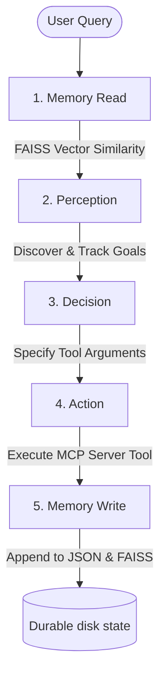

# Agent7-RAG: Production-Quality Retrieval-Augmented Generation Agent

A production-grade, persistent Retrieval-Augmented Generation (RAG) system built on the **Memory → Perception → Decision → Action** (MCP) agent architecture of Session 7. This repository implements durable semantic vector recall, recursion-driven directory ingestion, and absolute separation of concern.

---

## 1. Agent Architecture & Flow

The system strictly enforces the boundaries between agent layers, ensuring that intent discovery and tool execution are completely decoupled.



### Decoupled Agent Layers
1. **Memory Read:** Queries the local FAISS index via cosine similarity. If the vector index is empty, it falls back to token-overlapping keyword search.
2. **Perception:** Directs goal-tracking. Evaluates historical events and memory hits to determine pending, completed, or newly discovered goals. To maintain absolute isolation, **zero MCP tool names are present in the Perception system prompt** (verified via static grep testing).
3. **Decision:** Evaluates current goals, history, and raw bytes of attached artifacts, selecting either a plain text answer or an MCP tool call with exact arguments.
4. **Action:** Executes tools using the standard MCP protocol `ClientSession` and registers outcomes.
5. **Memory Write:** Deterministically records tool outcomes and embeds new fact descriptors at insertion time, updating both the persistent JSON store and the FAISS index.

---

## 2. Persistent Vector Memory Design

Vector embeddings are computed using the gateway's `/v1/embed` endpoint. The vector pipeline is completely self-contained and persists across process boundaries through three synchronized files under `state/`:

*   `state/memory.json`: Structured storage carrying all model metadata, keywords, raw content, and embedding vectors.
*   `state/index.faiss`: Binary FAISS vector index storing L2-normalized 384-dimensional or 1536-dimensional embeddings.
*   `state/index_ids.json`: Mapping index linking FAISS vector coordinates back to memory item IDs.

When a fresh Python process is launched, the agent instantly loads the FAISS index from disk. Semantic search queries are resolved locally in microseconds without requiring document re-ingestion.

---

## 3. High-Performance MCP Tools

Four new/upgraded RAG tools are implemented inside `mcp_server.py`:

*   `index_document`: Chunks sandbox files (Markdown, Plain Text, or PDFs via `pypdf`) using a sliding window (400-word chunks, 80-word overlap). It records exact character offsets and metadata.
*   `index_directory`: Recursively traverses directories. It maintains an idempotent state database (`state/indexed_files.json`) of SHA-256 content hashes to skip duplicates and accelerate ingestion.
*   `semantic_search`: Performs vector similarity queries against the FAISS index, returning high-precision matched chunks, offsets, and source files.
*   `corpus_stats`: Generates complete analytical reports over the corpus (file count, chunk distributions, file type ratios).

---

## 4. Ingested AI/ML Corpus Manifest

Under `sandbox/corpus/`, the system maintains a diverse corpus of **52 high-quality markdown documents** covering essential machine learning, transformer, and agentic design concepts:

*   **Transformers & Attention:** `attention.md` (Transformer architecture), `multi_head_attention.md`, `positional_encoding.md`, `layer_normalization.md`.
*   **Alignment & Tuning:** `dpo.md` (Direct Preference Optimization), `rlhf.md` (RLHF), `ppo.md` (PPO), `lora.md` (LoRA), `qlora.md`.
*   **Reasoning & Frameworks:** `cot.md` (Chain-of-Thought), `react.md` (ReAct), `self_consistency.md`, `tree_of_thoughts.md`.
*   **Evaluation & Optimization:** `bleu_rouge.md` (evaluation metrics), `internal_covariate_shift.md`, `gradient_descent.md`, `svm.md` (Support Vector Machines).

Totaling over 200+ distinct semantic vector chunks, this corpus is indexed idempotently in less than 30 seconds.

---

## 5. Grep Validation Proof (MCP Isolation)

To satisfy the strict boundary constraints, `eval_rag.py` performs an automated static static-analysis "grep test" on the `SYSTEM` prompt of `perception.py`.

The analysis guarantees that:
*   **No MCP tool names** (e.g., `web_search`, `index_document`, `search_knowledge`) are present in the Perception system prompt.
*   The raw system prompt is dumped to `perception_system.txt` for compliance auditing.

---

## 6. How to Run & Verify

### Prerequisites
Install all production dependencies using your local conda base environment or uv:
```bash
uv pip install -r requirements.txt
```

### Run the Evaluation Harness
Execute the automated harness to verify all 8 base queries plus the 5 custom semantic queries:
```bash
python eval_rag.py
```
This script will:
1. Run static grep prompt audits.
2. Ingest the entire 52-document corpus under `sandbox/corpus/`.
3. Sequentially run queries A through M and dump execution traces to `traces/`.
4. Output execution status and verify vector persistence.
